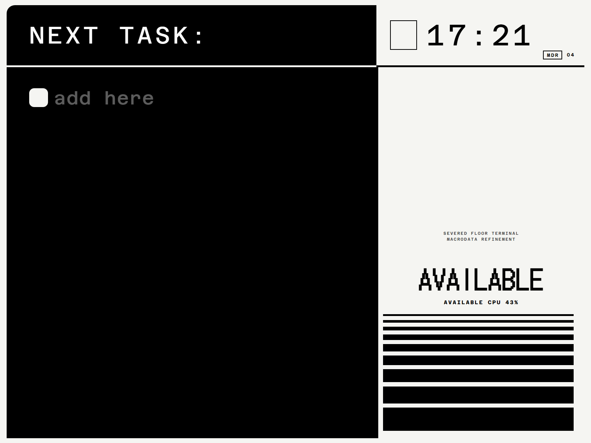

# QUTE Display



QUTE Display is a CRT-inspired desktop dashboard for checklists, notes, music controls, and a billboard view.

## Get started

Open `index.html` in a modern browser, or serve the directory locally:

```sh
python -m http.server 8000
```

Then visit `http://localhost:8000`. The optional Windows notification and media bridge starts with `bridge/start-bridge.bat`.

GitHub Pages deploys a minimal browser bundle automatically when `main` is updated. In the repository settings, set **Pages → Source** to **GitHub Actions** once the workflow has been pushed.

## Project map

| Path | Purpose |
| --- | --- |
| `index.html`, `style.css`, `app.js` | The browser application |
| `bridge/` | Optional Windows notification and media bridge |
| `threeD/` | 3D models and audio used by the interface |
| `Fonts/` | Local typography assets |
| `docs/` | Release notes and project documentation |

## Contributing

Small, focused pull requests are welcome. Please read [CONTRIBUTING.md](CONTRIBUTING.md) first.

## License and assets

The project code is available under the [MIT License](LICENSE). Some bundled fonts, models, audio, and images may have their own terms; check [ASSET_NOTICES.md](ASSET_NOTICES.md) before redistributing them.
